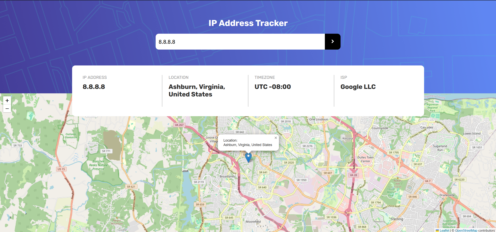

# IP Address Tracker Website Using ReactJS



This is a coding challenge from the [Frontend Mentor](https://www.frontendmentor.io/challenges/ip-address-tracker-I8-0yYAH0)

## Demo Video 


## Use of API

ipify, IP-API and freeIPAPI is used for fetching IP address and related geographical info. React-leaflet is used to display the location based on the fetched information.

ipify is only used to fetch users' ip address. It is not used to fetch geographical information because it require an API key, while IP-API and freeIPAPI does not.

## Features

- Users' ip address and geographical location is fetched when they load the webpage. Related information and the location on map will be shown afterward.

- Input (Ip address searching) validation

## Issues with IP-API

IP-API is blocked by browser as IP-API only support http request but not https, which caused mixed content issue. Therefore, the app does not work when deployed to github page.

```js
async function getIpDetail(ipAddress, setIpDetail, setErrorState = ()=>{}){
    // ip-api IP Geolocation API is used
    const APIpath = `http://ip-api.com/json/${ipAddress}`;
    /// ...   
}
``` 

In addition, timezone offset data is not avaliable from IP-API. As a result, additional API (freeIPAPI) is used to fetch the timezone(e.g. UTC -08:00) of the IP address.

```js
// Another API is used for getting the time zone becuase ip-api's "offset" data is unavailbale (undefined)
async function getTimeZone(ipAddress){
    const APIpath = `https://freeipapi.com/api/json/${ipAddress}`;
    
    try{
        const response = await fetch(APIpath);
        const data = await response.json();
        return 'UTC ' + data.timeZone;
    } 
    catch(error) {
        console.log("Get timeZone error\n", error);
        return null;
    }
}
```